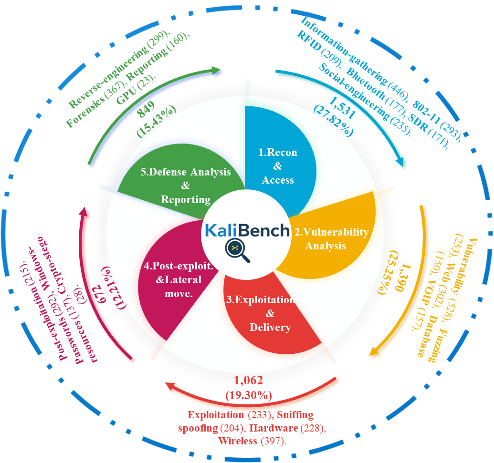
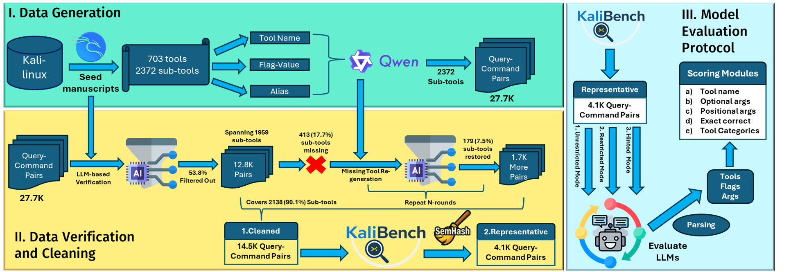
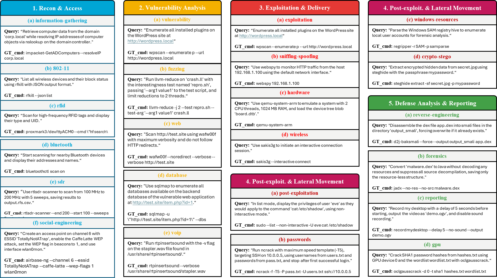

# : A Fine-Grained Benchmark for Cybersecurity Tool Use on Kali Linux with Runtime-Free Verifiable Rewards

**Official repository for the KaliBench paper (Under Review).**

---

## 📋 Table of Contents

- [Overview](#-overview)
- [KaliBench Samples](#-kalibench-pipeline-and-samples)
- [Getting Started](#-getting-started)
- [Dataset and Benchmarks](#-dataset-and-benchmarks)
- [Evaluation](#-evaluation)
- [Scoring](#-scoring)

---

## 🔥 Overview
**KaliBench** is a benchmark that targets Query-to-CLI translation on Kali Linux, evaluating LLMs across three tool-knowledge settings and 23 fine-grained tool dimensions. It comprises 8,504 query-command pairs spanning 1,642 sub-tools. We find that low command accuracy mostly stems from argument reconstruction errors, and SFT+GRPO can lift 8B models to near 70B performance.


### 🔧 KaliBench Tool Coverage Overview
> **Cybersecurity workflows span diverse capabilities across the entire attack and defense lifecycle, from reconnaissance to exploitation, to forensic analysis. KaliBench explicitly captures this diversity by covering 23 Kali Linux capability dimensions, enabling systematic evaluation of model performance across different security phases rather than isolated tool families.**

<p align="center">
  
</p>
<!--
<p align="center">
  <em><strong>KaliBench Tool Overview.</strong> The benchmark spans 23 Kali Linux capability dimensions across the full cyber chain, from reconnaissance to defensive forensics.</em>
</p>
-->

<!-- ## 🧩 KaliBench Pipeline and Samples

### 🔁 How KaliBench Is Constructed and Evaluated
> **Accurate Query-to-CLI evaluation requires both high-quality data and rigorous validation. KaliBench is built through:
Multi-stage Data Verification \& Cleaning including:
(I). LLM-based verification;
(II). Terminal-based sandbox verification and Rule-based filtering;
(III). Human-in-Loop Verification and Manual inspection of the data based on failure cases involving both the AI-agent and the human. 
(IV). Semantic deduplication and dataset splitting.
> -We also have our Training Protocols:
(I). Supervised-FineTuning (SFT)
(II). Reinforcement Learning with Verifiable Reward (RLVR with GRPO)**
> 
<p align="center">
  
</p>
<!--
<p align="center">
  <em>
    <strong>KaliBench End-to-End Pipeline.</strong>
    The benchmark is constructed via LLM-based data generation, multi-round verification-regeneration, and representative sample selection.
    Evaluation is conducted in three modes (unrestricted, restricted, and hinted), with alias-aware parsing and fine-grained scoring over tools, arguments, and capability dimensions.
  </em>
</p>
-->


### 🧪 KaliBench Samples
> **Each KaliBench sample contains a natural-language query with decomposed parameters and a single canonical CLI command. Together, the samples span 23 tool categories and five cyber phases, enabling fine-grained analysis of where models succeed or fail in translating security intent into executable commands.**
> 
<p align="center">
  
</p>
<!--
<p align="center">
  <em><strong>Overview of KaliBench Samples.</strong> It spans 23 tool categories and 5 cyber phases.</em>
</p> -->


## 🚀 Getting Started

### 1. Installation

1.  **Clone the repository:**
    ```bash
    git clone https://github.com/RISys-Lab/KaliBench.git
    cd KaliBench
    ```

2.  **Create a virtual environment:**
    ```bash
    conda create -n kalibench python=3.10
    conda activate kalibench
    ```

3.  **Install dependencies:**
    We utilize `vLLM` for efficient MLLM inference.
    ```bash
    pip install -r requirements.txt
    ```
    > [!NOTE]
    > Different hardware configurations may require specific vLLM installation steps or arguments. Please refer to the [official vLLM documentation](https://docs.vllm.ai/en/latest/) for detailed instructions tailored to your hardware.


## 📊 Dataset and Benchmarks
KaliBench provides 3 files, 1. A full document of 8.5K query-command pairs 2. An evaluation document of selective 5000 query-command pairs (the users can also select their own evaluation set from the full 8.5K document), and 3. A Raw Kali Linux document containing the original usage code (manuscript) for all Kali 2,809 tools.

#### User can directly find the aforementioned 3 data files (.jsonl format) in the folder: "KaliBench_data"; Or go to the Hugging Face Page: [KaliBench](https://huggingface.co/datasets/anonymous62567/KaliBench-Verified)
<!-- #### -We additionally provide raw homepages about all Kali tools, which not only include each tool's usage code, but also include other metadata such as a tool's label (metapackages), packagesinfo, and so on.
- The tools' homepages are hosted on Hugging Face: **[RISys-Lab/kali-tools](https://huggingface.co/datasets/RISys-Lab/kali-tools)**, and can be viewed in the following way: 
  
```bash
# Load data set
from datasets import load_dataset
ds = load_dataset("RISys-Lab/kali-tools")

# View a tool sample
ds['train'][1]

# View a tool's label
ds['train'][1]['metadata']['metapackages']
```
-->

## ✅ Evaluation
> We used the [Offline Inference with the OpenAI Batch file format](https://docs.vllm.ai/en/stable/examples/offline_inference/openai_batch/?h=batch+inference#file-format) to do inference in 2 steps:
### 1. Generate vllm request for each query in different modes (eval_request/request_prompt.py)

- **Unrestricted Mode**
```powershell
# replace ".\" with your absolute route, replace "models/meta-llama/Meta-Llama-3-8B-Instruct" with your model's storage route
# out_labels: output label file is the same for 3 modes

python .\request_prompt.py --mode unrestricted --input ".\kalibench_verified_test_5000.jsonl" --subtools ".\Kali_Tool_Subtools_UsageCode.jsonl" --out_requests ".\unrestricted_requests.jsonl" --out_labels ".\labels.jsonl" --model "models/meta-llama/Meta-Llama-3-8B-Instruct" --temperature 0.2 --tools_per_chunk 20 --max_usage_chars 800 --include_usage_in_prompt false

```
- **Restricted Mode**
```powershell
python .\request_prompt.py --mode restricted --input ".\kalibench_verified_test_5000.jsonl" --subtools ".\Kali_Tool_Subtools_UsageCode.jsonl" --out_requests ".\restricted_requests.jsonl" --out_labels ".\labels.jsonl" --model "models/meta-llama/Meta-Llama-3-8B-Instruct" --temperature 0.2 --tools_per_chunk 20 --max_usage_chars 800 --include_usage_in_prompt false
```
- **Hinted Mode**
```powershell
python .\request_prompt.py --mode hinted --input ".\kalibench_verified_test_5000.jsonl" --subtools ".\Kali_Tool_Subtools_UsageCode.jsonl" --out_requests ".\hinted_requests.jsonl" --out_labels ".\labels.jsonl" --model "models/meta-llama/Meta-Llama-3-8B-Instruct" --temperature 0.2 --tools_per_chunk 20 --max_usage_chars 800 --include_usage_in_prompt true

```

### 2. Run the vllm batch inference
```bash
# run the VLLM batch inference by specifying the input file, the output file, and the model. Below is an example:
python -m vllm.entrypoints.openai.run_batch \
    -i ./unres_llama_8b.jsonl \
    -o ./unres_llama_8b-out.jsonl \
    --model ./meta-llama/Meta-Llama-3-8B-Instruct
```

## 🏆 Scoring
### 1. Model Score (scoring\model_score.py)
> Calculate model scores, including: Tool score, Optional F1, Positional F1, Total score, and Exact match
```powershell
python model_score.py --vllm_file ".\unres_llama_8b-out.jsonl" --label_file ".\labels.jsonl" --out ".\unres_llama_8b-scores.jsonl"
```
### 2. Dimensional Score (scoring\dim_score.py)
> Calculate dimensional scores across 5 security phases and 23 tool dimensions. The --models-folder is your folder that stores all 'model-score.jsonl' files derived in step 1. 

```powershell
python .\dim_score.py --models-folder ".\score_folder" --output-folder ".\dim_score" --use-hf --hf-dataset "RISys-Lab/kali-tools"
```

<!--
## 📝 Citation

If you find KaliBench useful in your research, please consider citing our paper:
```bibtex
@inproceedings{li2026safire,
  title={KaliBench: Evaluating LLM Function Calling on Kali Linux for Cybersecurity Tool Use},
  author={Li, Pengfei and Suryanto, Naufal and Zhang, Sicheng and Naseer, Muzammal},
  booktitle={Proceedings of the 64th Annual Meeting of the Association for Computational Linguistics (ACL)},
  year={2026}
}
```
-->

